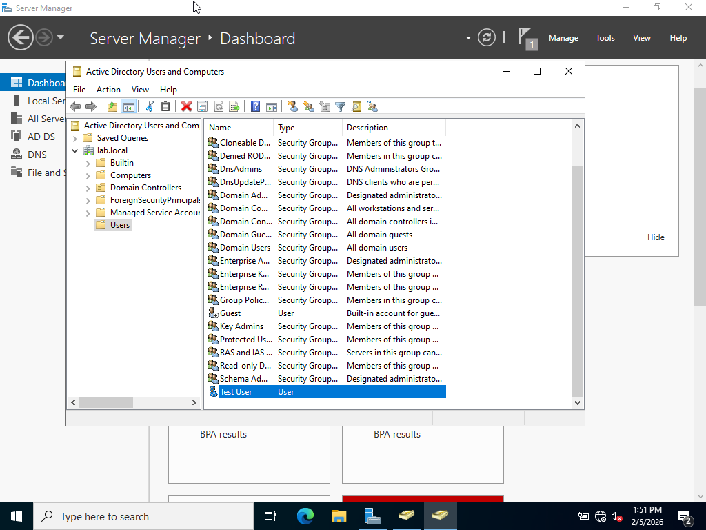
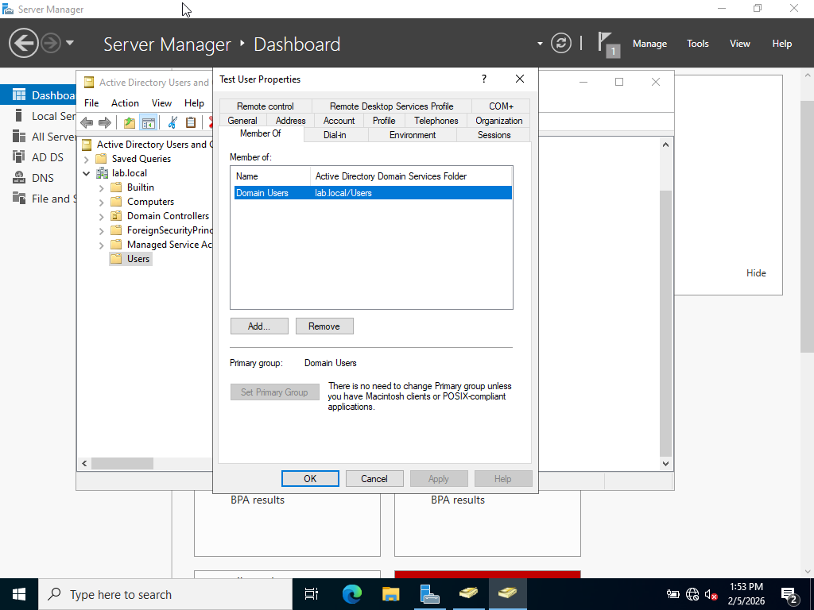
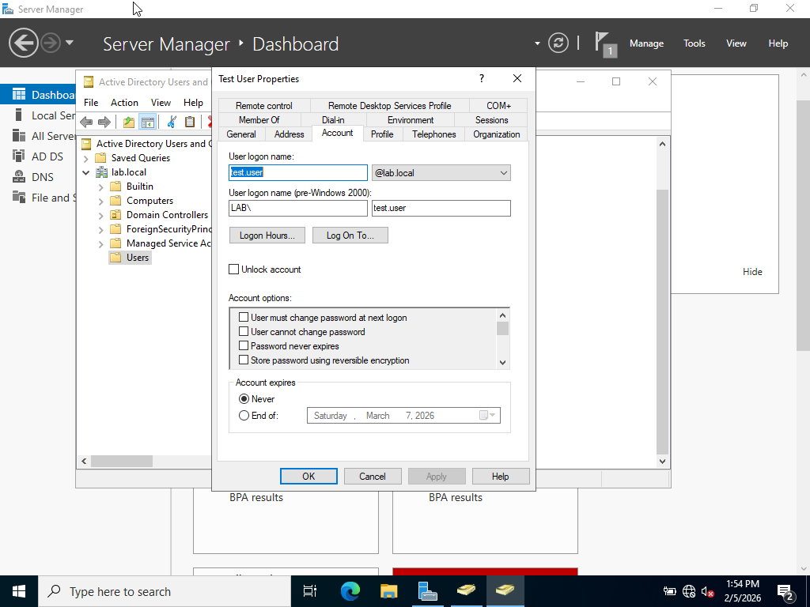

# Active Directory User Creation & Group Assignment

## Lab Objective
To create a new user account in Active Directory and assign the user to appropriate security groups, simulating a basic employee onboarding task.

## Tools Used
- Windows Server
- Active Directory Users and Computers (ADUC)

## Steps Performed
1. Opened Active Directory Users and Computers (ADUC)
2. Navigated to the appropriate Organizational Unit (OU)
3. Created a new user account with standard naming conventions
4. Set an initial password and configured password options
5. Added the user to relevant security groups
6. Verified group membership and account status

## Outcome
The user account was successfully created and assigned to security groups, allowing appropriate access based on role.

## Screenshots

## What I Learned
- How user accounts are created and managed in Active Directory
- The importance of security groups for access control
- How Active Directory supports employee onboarding and access management
